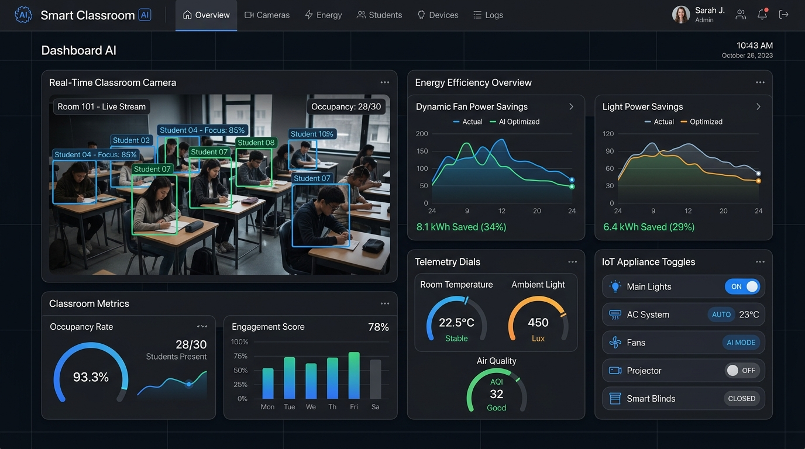
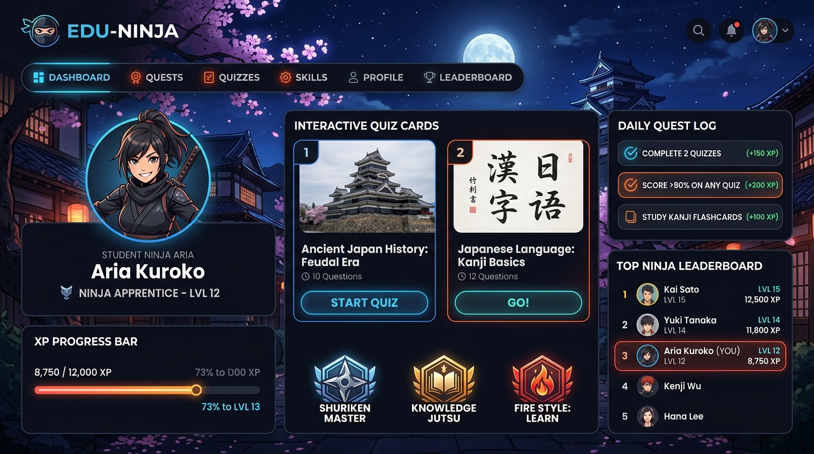
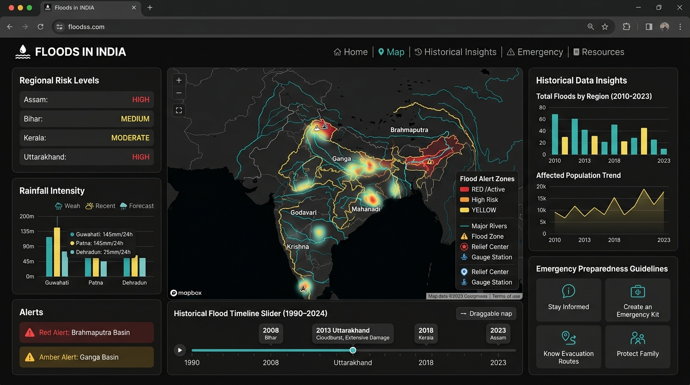
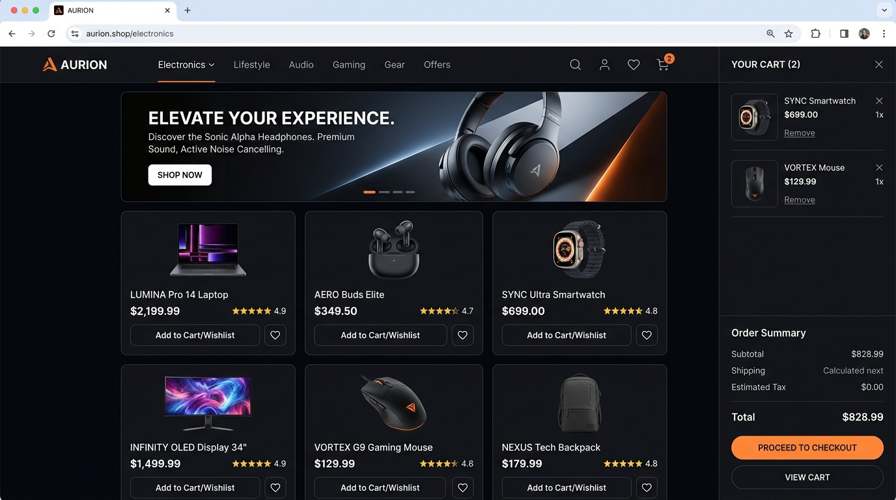

# Sheikh Arsalan — Personal Portfolio & Projects Showcase 🚀

<div align="center">



### **Computer Science Engineer · AI & ML Enthusiast · Full-Stack Developer**

[](https://react.dev/)
[](https://vitejs.dev/)
[](https://www.framer.com/motion/)
[](https://tailwindcss.com/)
[](https://www.emailjs.com/)
[](LICENSE)

[**🌐 View Live Portfolio**](https://github.com/Arsalan0786/arsalan) • [**💼 LinkedIn**](https://www.linkedin.com/in/sheikharsalan8146) • [**🐙 GitHub**](https://github.com/Arsalan0786) • [**📸 Instagram**](https://www.instagram.com/sheikharsalan8146) • [**📄 Resume / CV**](public/resume.pdf)

</div>

---

## 📌 Table of Contents

- [About Me](#-about-me)
- [Featured Projects Deep Dive](#-featured-projects-deep-dive)
  - [1. Smart Classroom AI Dashboard](#1-smart-classroom-ai-dashboard)
  - [2. Edu-Ninja — Gamified Learning Platform](#2-edu-ninja--gamified-learning-platform)
  - [3. Floods in India — Awareness & Historical Insights](#3-floods-in-india--awareness--historical-insights)
  - [4. E-Commerce Shopping Website](#4-e-commerce-shopping-website)
- [Technical Skills](#-technical-skills)
- [Experience & Community Leadership](#-experience--community-leadership)
- [Education & Academic Foundation](#-education--academic-foundation)
- [Certifications & Achievements](#-certifications--achievements)
- [Portfolio Web Application Architecture](#-portfolio-web-application-architecture)
- [Getting Started & Local Setup](#-getting-started--local-setup)
- [Contact & Connect](#-contact--connect)

---

## 👨‍💻 About Me

> *"I’m a Computer Science Engineer passionate about building practical, technology-driven solutions to real-world problems. I enjoy working across AI/ML, software development, and emerging technologies, turning ideas into functional products that create meaningful impact.*
>
> *I’ve worked on projects spanning AI-powered dashboards, healthcare analytics, and intelligent systems, while also gaining experience through hackathons and hands-on development. I’m particularly interested in exploring how AI can be applied beyond theory to solve complex problems at scale.*
>
> *Always learning, building, and experimenting. I’m looking to collaborate with people and teams working on ambitious ideas where technology can make a real difference."*

- 📍 **Location:** Srinagar, Jammu & Kashmir, India
- 🎓 **Education:** B.Tech in Computer Science and Engineering @ Lovely Professional University (2024 — 2028)
- 🎯 **Primary Focus:** Artificial Intelligence, Computer Vision, Machine Learning, Full-Stack Development
- 💡 **Interests:** Robotics, IoT systems, Gamified EdTech, Disaster Management Tech, Open-Source Software

---

## 🌟 Featured Projects Deep Dive

A detailed overview of the core engineering projects developed across AI/ML, computer vision, data analytics, and full-stack web engineering:

---

### 1. Smart Classroom AI Dashboard

<div align="center">
  
</div>

<br />

| Metric / Attribute | Details |
| :--- | :--- |
| **Project Type** | Computer Vision, IoT & Energy Optimization Platform |
| **Status** | Completed / Production Ready |
| **Timeline** | May 2026 |
| **Repository** | [github.com/Arsalan0786/smart-classroom](https://github.com/Arsalan0786/smart-classroom) |
| **Tech Stack** | `Python` `YOLOv8` `OpenCV` `Flask` `Flask-SocketIO` `SQLite` `JavaScript` `Chart.js` |

#### 📋 Overview
A real-time AI-powered classroom monitoring and telemetry system engineered using computer vision to detect student occupancy, calculate density distributions by classroom zones, and dynamically actuate electrical appliances (fans, lights, HVAC) to eliminate unnecessary power wastage in educational institutions.

#### ⚠️ The Problem
Educational institutions incur massive electrical bills and unnecessary carbon footprints because classroom lights, air conditioning, and fans run continuously in unoccupied zones or completely empty lecture halls.

#### 💡 The Technical Solution
- Deployed a **YOLOv8 deep learning object detection** pipeline integrated with **OpenCV** to stream camera feeds and track individual human coordinates within predefined spatial zones.
- Designed **real-time bi-directional WebSockets (`Flask-SocketIO`)** that instantly transmit zone occupancy metrics to an intuitive web dashboard and send trigger signals to simulated/hardware relay switches.
- Built an interactive telemetry dashboard with **Chart.js** displaying real-time power consumption, cumulative energy saved (kWh), occupancy heatmaps, and manual/AI appliance overrides.

#### 🚀 Future Scope & Expansion
- Expansion with physical ESP32/Raspberry Pi microcontrollers and industrial relay boards.
- Facial recognition-based attendance automation and ambient lighting sensor calibration.
- Predictive campus-wide energy optimization using historical occupancy analytics.

---

### 2. Edu-Ninja — Gamified Learning Platform

<div align="center">
  
</div>

<br />

| Metric / Attribute | Details |
| :--- | :--- |
| **Project Type** | Gamified EdTech Web Application |
| **Status** | Completed |
| **Timeline** | Sep 2025 |
| **Repository** | [github.com/Arsalan0786/Edu-Ninja](https://github.com/Arsalan0786/Edu-Ninja) |
| **Tech Stack** | `React.js` `Node.js` `JavaScript` `HTML5` `CSS3` `Framer Motion` |

#### 📋 Overview
An interactive educational web platform engineered to transform middle-school syllabus learning into an engaging, gamified adventure. Features a Japanese ninja-themed aesthetic where students level up, earn XP, complete daily quest challenges, and unlock mastery badges through interactive quizzes.

#### ⚠️ The Problem
Traditional homework and static textbooks frequently cause middle-school students to lose focus, disengage, and fail to retain key foundational STEM concepts.

#### 💡 The Technical Solution
- Developed a modular **React.js** frontend with custom state loops tracking student streaks, score multipliers, and dynamic level progression (Level 1 Novice to Level 15 Shadow Master).
- Created interactive quiz engines featuring timed flashcards, multiple-choice modules, and visual feedback micro-animations.
- Incorporated badge and mastery rewards (*Shuriken Master*, *Knowledge Jutsu*, *Fire Style: Learn*) and persistent leaderboard standings to foster friendly academic motivation.

#### 🚀 Future Scope & Expansion
- Integration of adaptive AI recommendation engines to automatically calibrate quiz difficulty based on individual student performance.
- Multiplayer collaborative study battles and classroom teacher management dashboards.

---

### 3. Floods in India — Awareness & Historical Insights

<div align="center">
  
</div>

<br />

| Metric / Attribute | Details |
| :--- | :--- |
| **Project Type** | Geospatial Data Visualization & Disaster Awareness Portal |
| **Status** | Completed |
| **Timeline** | Apr 2025 |
| **Repository** | [github.com/Arsalan0786/FloodinIndia](https://github.com/Arsalan0786/FloodinIndia) |
| **Tech Stack** | `HTML5` `CSS3` `JavaScript (ES6+)` `Data Visualization` `Mapbox / SVG Mapping` |

#### 📋 Overview
A comprehensive public awareness portal showcasing the history and geography of major flood disasters across India. Combines an interactive basin-level geographical map, chronological disaster timeline, historical trend statistics, and actionable emergency preparedness guidelines.

#### ⚠️ The Problem
Crucial flood risk data, historical inundation patterns, and life-saving disaster preparedness protocols are often buried in inaccessible government PDFs, leaving vulnerable communities underprepared.

#### 💡 The Technical Solution
- Designed an interactive visual map highlighting high-risk Indian river basins (Ganga, Brahmaputra, Mahanadi, Godavari, Krishna) with color-coded alert severity levels (Red / Active, High Risk, Moderate).
- Engineered a **chronological timeline slider spanning 1990 to 2024**, documenting catastrophic events (2008 Bihar, 2013 Uttarakhand, 2018 Kerala, 2023 Assam) with impact metrics and rainfall data.
- Built an **Emergency Preparedness Knowledge Center** providing clear, illustrated evacuation protocols, emergency kit checklists, and relief station contacts.

#### 🚀 Future Scope & Expansion
- Integration of live Central Water Commission (CWC) API feeds for real-time water level alerts.
- Geolocation-based automated SMS and push notifications for residents in rising water zones.

---

### 4. E-Commerce Shopping Website

<div align="center">
  
</div>

<br />

| Metric / Attribute | Details |
| :--- | :--- |
| **Project Type** | Multi-Page Full-Stack Shopping Experience |
| **Status** | 🚧 Active Development |
| **Timeline** | Dec 2024 — Present |
| **Repository** | [github.com/Arsalan0786](https://github.com/Arsalan0786) |
| **Tech Stack** | `JavaScript` `HTML5` `CSS3` `Font Awesome` `Responsive Architecture` |

#### 📋 Overview
A sleek, responsive multi-page e-commerce web platform engineered with pure modular JavaScript, custom CSS tokens, and modern retail design paradigms. Includes product discovery catalogs, modal previews, live search filtering, animated wish list toggles, and an interactive slide-over shopping cart.

#### ⚠️ The Problem
Creating a high-performance, seamless shopping journey with micro-interactions, responsive touch ergonomics, and state synchronization without the overhead of heavy third-party bundles.

#### 💡 The Technical Solution
- Implemented an event-driven JavaScript state manager handling cart operations (item add/remove, quantity adjustment, coupon calculation, subtotal updates) stored persistently in `localStorage`.
- Designed a dark-mode luxury retail aesthetic featuring banner sliders, category navigation filters, and animated product cards.
- Engineered responsive layouts with CSS Grid and Flexbox ensuring fluid browsing across mobile, tablet, and ultra-wide displays.

#### 🚀 Future Scope & Expansion
- Backend microservices with Node.js/Express and PostgreSQL database for user auth and inventory records.
- Razorpay / Stripe payment gateway integration with end-to-end checkout validation.

---

## 🛠️ Technical Skills

```
Languages:        Python, C++, Java, C, JavaScript (ES6+), SQL
AI & Data:        YOLOv8, OpenCV, Machine Learning, Data Analytics, Pandas, NumPy
Frontend:         React.js, HTML5, CSS3, Tailwind CSS, Framer Motion, Responsive Design
Backend & APIs:   Node.js, Flask, Flask-SocketIO, RESTful APIs, SQLite
Tools & Systems:  Git, GitHub, VS Code, Postman, Figma, Linux, Vite
Engineering:      Data Structures & Algorithms (DSA), Object-Oriented Programming (OOP)
```

---

## 💼 Experience & Community Leadership

| Role | Organization | Period | Highlights |
| :--- | :--- | :--- | :--- |
| **Social Media Executive** | **Young Kashmir Research Society (YKRS)** | Jun 2023 — Jun 2026 | Assists students in academic paper publication by connecting them directly with university professors & research labs. |
| **Member & Hardware Builder** | **RISC (Robotics & Intelligent System Community)** | Aug 2024 — Dec 2025 | Built FPV racing drones, functional model aircraft, and custom IoT robotic hardware at Lovely Professional University. |
| **Founding Member & Media Head** | **Charkha Foundation** | Jan 2024 — Jul 2025 | Spearheaded digital presence and public policy advocacy programs for youth development and community research. |
| **Graphic Designing Head** | **Qubits — Burn Hall Tech Society** | Sep 2023 — Sep 2024 | Led visual brand identity, marketing campaigns, and tech workshops across 20+ participating schools in Kashmir. |
| **Deputy Director General** | **Youth Leaders Council (YLC)** | Aug 2023 — May 2024 | Replicated United Nations committee debates and executive conference operations for aspiring youth diplomats. |
| **Intern & Volunteer** | **I.I.M.U.N.** | Apr 2023 — Nov 2023 | Coordinated youth diplomacy summits, created digital assets, and managed participant data pipelines. |

---

## 🎓 Education & Academic Foundation

### **Lovely Professional University (LPU)** — *Punjab, India*
- **Degree:** Bachelor of Technology (B.Tech) in Computer Science and Engineering
- **Duration:** Aug 2024 — Expected May 2028
- **Specialization / Focus:** Artificial Intelligence & Machine Learning
- **Activities:** Active builder in RISC Robotics Community, Hackathon participant, Full-Stack and AI Developer.

### **Burn Hall Hr. Sec. School** — *Srinagar, J&K*
- **Certificate:** Class XII (Higher Secondary Certificate) — Science & Mathematics
- **Result:** **90% Academic Distinction**
- **Leadership:** Head of Graphic Design at Qubits Tech Society.

---

## 🏆 Certifications & Achievements

- **Data Structures and Algorithms** — *iamneo (An NIIT Venture)* · Credential: `21a64AJDaK4bL5dM78j1`
- **Object Oriented Programming** — *iamneo (An NIIT Venture)* · Credential: `188h1G32a14D63dj7BK1`
- **Programming in Java** — *iamneo (An NIIT Venture)* · Credential: `27bk5al45m8b25D738N1`
- **Programming Using C++** — *Infosys Springboard Certified*
- **Problem Solving (Basic)** — *HackerRank Certified*
- **Python (Basic)** — *HackerRank Certified*
- **Prompt Engineering for ChatGPT** — *Vanderbilt University (Coursera)*
- **Crash Course on Python** — *Google Professional Certificate*
- **Introduction to Cloud Computing** — *IBM Developer Skills Network*
- **Foundations: Data, Data, Everywhere** — *Google Career Certificates*

---

## 🏗️ Portfolio Web Application Architecture

The portfolio application is built with modern, high-performance web standards:

```
Portfolio/
├── public/
│   ├── favicon.svg               # Vector brand favicon
│   ├── profile.png               # Profile portrait
│   ├── resume.pdf                # Downloadable / viewable resume
│   └── projects/
│       ├── smart-classroom.jpg   # Smart Classroom AI UI preview
│       ├── edu-ninja.jpg         # Edu-Ninja gamified platform UI preview
│       ├── floods-in-india.jpg   # Floods in India awareness portal UI preview
│       └── ecommerce.jpg         # E-Commerce storefront UI preview
├── src/
│   ├── components/
│   │   ├── About/                # Detailed personal bio & quick-fact cards
│   │   ├── Achievements/         # Interactive sorted certifications & badges
│   │   ├── Contact/              # EmailJS-powered form & direct info cards
│   │   ├── Education/            # Academic degree cards & highlights
│   │   ├── Experience/           # Timeline of internships & student leadership
│   │   ├── Footer/               # Quick navigation & social icon links
│   │   ├── Hero/                 # Animated introduction & CTAs
│   │   ├── Navbar/               # Responsive header with blur glassmorphism
│   │   ├── Projects/             # Project cards with hover zoom & preview modal
│   │   ├── Skills/               # Categorized skill badges with proficiency levels
│   │   └── UI/                   # Reusable SectionWrapper & SectionHeader
│   ├── data/
│   │   ├── achievements.js       # Verified certificate list (reverse chron)
│   │   ├── education.js          # Education degree data
│   │   ├── experience.js         # Work experience & leadership roles
│   │   ├── projects.js           # Comprehensive project details & metadata
│   │   ├── siteConfig.js         # Personal bio, links, and EmailJS credentials
│   │   └── skills.js             # Technical skill groups
│   ├── App.jsx                   # Master application assembler
│   ├── index.css                 # Custom design tokens, glassmorphism & resets
│   └── main.jsx                  # Application entry point
├── package.json
└── vite.config.js
```

---

## ⚡ Getting Started & Local Setup

To run this portfolio locally on your machine:

### 1. Prerequisites
Ensure you have **Node.js** (v18.0.0 or higher) and **npm** installed:
```bash
node -v
npm -v
```

### 2. Clone the Repository
```bash
git clone https://github.com/Arsalan0786/arsalan.git
cd arsalan
```

### 3. Install Dependencies
```bash
npm install
```

### 4. Run Development Server
```bash
npm run dev
```
Open `http://localhost:5173` (or the port indicated in terminal) in your browser.

### 5. Build for Production
```bash
npm run build
```
The optimized production bundle will be output to the `dist/` folder.

---

## 📬 Contact & Connect

Feel free to reach out for collaborations, hackathons, open-source projects, or software engineering opportunities:

- 📧 **Email:** [sheikharsalan0223@gmail.com](mailto:sheikharsalan0223@gmail.com)
- 💼 **LinkedIn:** [linkedin.com/in/sheikharsalan8146](https://www.linkedin.com/in/sheikharsalan8146)
- 🐙 **GitHub:** [github.com/Arsalan0786](https://github.com/Arsalan0786)
- 📸 **Instagram:** [instagram.com/sheikharsalan8146](https://www.instagram.com/sheikharsalan8146)

---

<div align="center">

*Designed & Developed by **Sheikh Arsalan** · © 2026 All rights reserved.*

</div>
